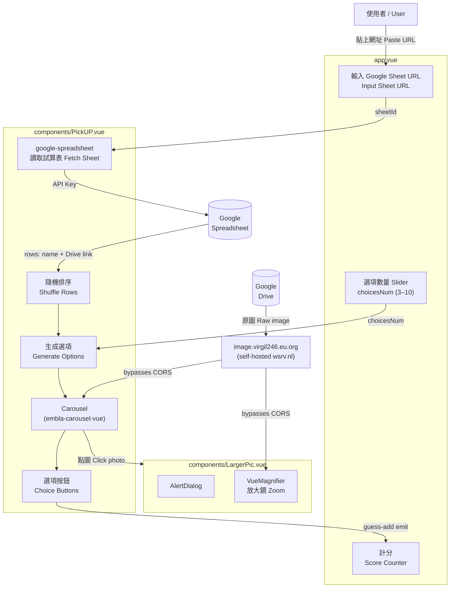

# 抽抽 Photo Guess / 照片猜名遊戲

一個照片猜名小遊戲。把你的 Google 試算表貼上來，就能開始考驗你認不認識照片裡的人。

A photo guessing game. Paste your Google Sheet URL and start testing whether you can match faces to names.

---

## 玩法 / How to Play

1. 把 Google 試算表的網址貼到欄位裡
2. 選擇每題要有幾個選項（3–10 個）
3. 點「抽」開始遊戲
4. 瀏覽照片，從選項中選出正確的名字
5. 點「答案和分數」查看結果

---

1. Paste your Google Sheet URL into the input field
2. Choose how many options per question (3–10)
3. Click「抽」to start
4. Browse through the photos and pick the correct name
5. Click「答案和分數」to reveal answers and see your score

---

## Google 試算表格式 / Sheet Format

試算表的欄位順序需如下：

The sheet columns must be in this order:

| A | B | C | D |
|---|---|---|---|
| (任意) | Google Drive 圖片分享連結 | (任意) | 姓名 |
| (any) | Google Drive photo share link | (any) | Name |

圖片請使用 Google Drive 的分享連結（格式：`https://drive.google.com/file/d/.../view?usp=sharing` 或含 `?id=` 的連結）。

Photos should use Google Drive share links (e.g. `https://drive.google.com/file/d/.../view?usp=sharing` or links containing `?id=`).

---

## 開發環境 / Development

```bash
pnpm install
pnpm dev
```

Dev server runs at `https://localhost:3000` (HTTPS required — configure local certs in `nuxt.config.ts`).

```bash
pnpm build    # Production build
pnpm preview  # Preview production build
```

---

## 架構圖 / Architecture



---

## 技術棧 / Tech Stack

- [Nuxt 3](https://nuxt.com) (SSR disabled, SPA mode)
- [shadcn-nuxt](https://www.shadcn-vue.com) + [Tailwind CSS](https://tailwindcss.com)
- [google-spreadsheet](https://theoephraim.github.io/node-google-spreadsheet) — fetch sheet data
- [embla-carousel-vue](https://www.embla-carousel.com) — photo carousel
- [vue-magnifier](https://github.com/WebsiteBeaver/vue-magnifier) — zoom on click
- `image.virgil246.eu.org` — 自架的 [wsrv.nl](https://wsrv.nl) 圖片 proxy，用來繞過 Google Drive 的 CORS 限制 / self-hosted wsrv.nl image proxy to bypass Google Drive CORS restrictions
